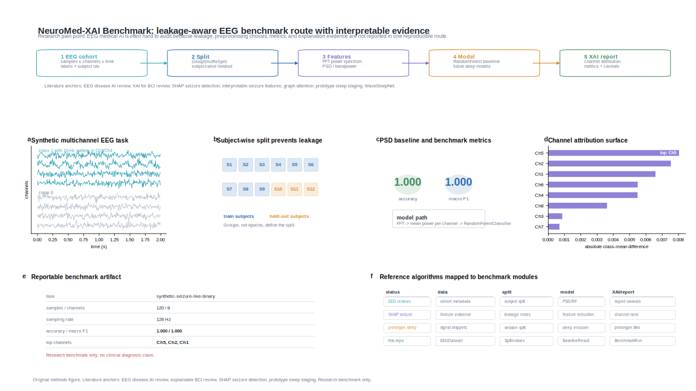

# NeuroMed-XAI Benchmark



Interpretable EEG benchmarks for biomedical AI research.

This project combines an EEG medical benchmark framework with explainable AI reporting. The first milestone focuses on reproducible baselines, leakage-aware splitting, and report generation for public EEG disease or neurophysiology datasets.

> Research prototype only. This project is not a medical device and does not provide clinical diagnosis.

## Why This Project

Biomedical EEG AI papers often report classification metrics without enough detail about data splits, leakage risks, channel/frequency evidence, or error cases. This project aims to make EEG medical AI experiments more reproducible and interpretable.

## Month-1 Goals

- Provide a runnable synthetic EEG benchmark pipeline.
- Define dataset and task abstractions for seizure detection and sleep staging.
- Implement classical baseline models and report generation.
- Generate interpretable channel, frequency-band, and temporal attribution summaries.
- Provide documentation for leakage-aware EEG evaluation.

## Quick Start

Mac development uses the system `python3` directly and does not create a `.venv`:

```bash
python3 -m pip install -e ".[dev]"
python3 -m pytest -q
python3 -m neuromed_xai_benchmark.cli demo
```

Windows development should continue to use the existing project interpreter:

```powershell
D:\AI_Env\dl_5060ti\python.exe -m pip install -e ".[dev]"
D:\AI_Env\dl_5060ti\python.exe -m pytest -q
D:\AI_Env\dl_5060ti\python.exe -m neuromed_xai_benchmark.cli demo
```

See [docs/SETUP_MAC.md](docs/SETUP_MAC.md) and [docs/SETUP_WINDOWS.md](docs/SETUP_WINDOWS.md) for the full cross-platform workflow.

## Project Layout

```text
neuromed_xai_benchmark/
  cli.py
  datasets/
  models/
  xai/
  reports/
docs/
  BACKGROUND.md
  ROADMAP.md
  TECHNICAL_PLAN.md
tests/
```

## Roadmap

See [docs/ROADMAP.md](docs/ROADMAP.md).
